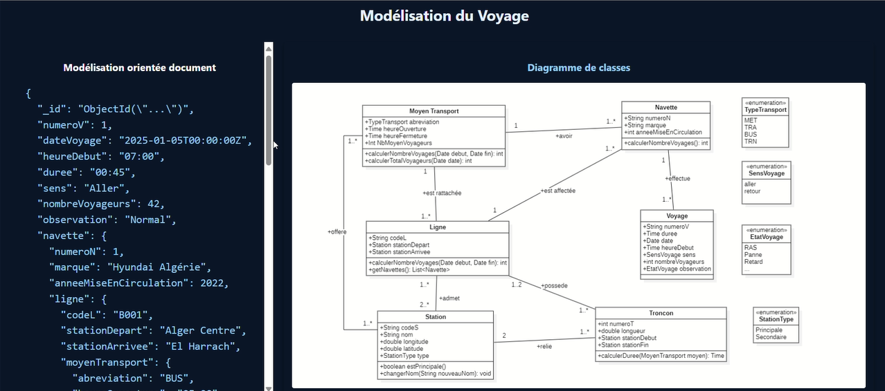
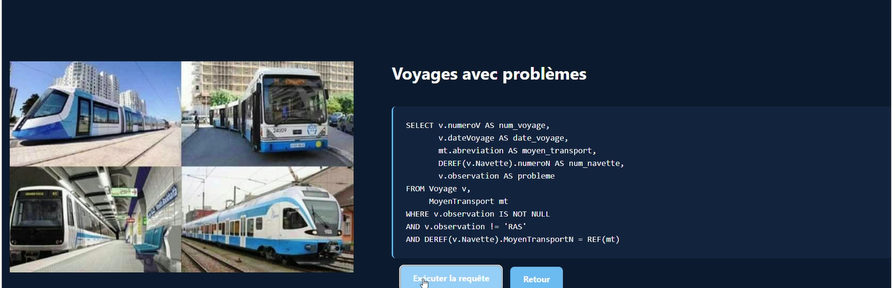
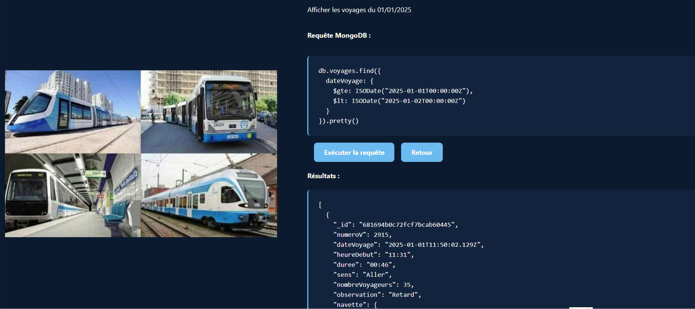
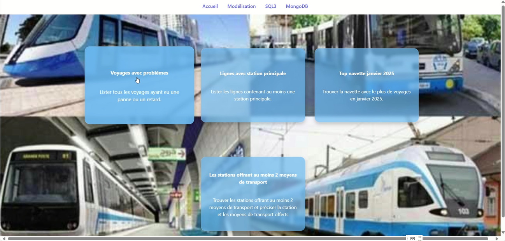
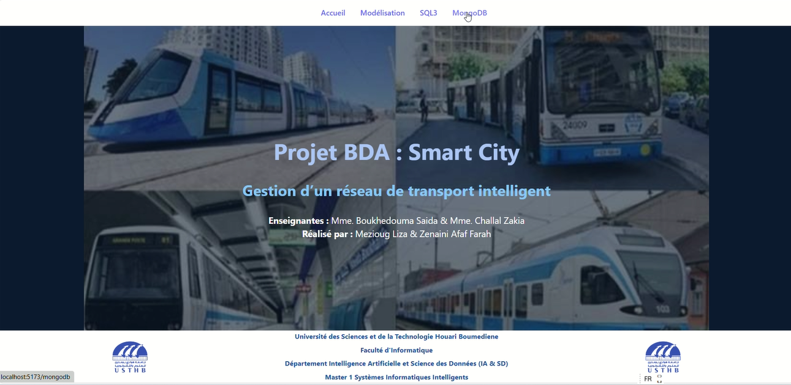

# Projet BDA : Smart City — Gestion d'un réseau de transport intelligent

Projet de bases de données avancées comparant deux approches de modélisation pour un système de gestion de transport public intelligent (bus, métro, tramway, train) : une base **Oracle relationnel-objet (SQL3)** et une base **NoSQL (MongoDB)**, exposées via une interface web permettant d'exécuter et de visualiser des requêtes sur les deux systèmes.

**Université des Sciences et de la Technologie Houari Boumediene (USTHB)**
Faculté d'Informatique — Département Intelligence Artificielle et Science des Données
Master 1 Systèmes Informatiques Intelligents

**Enseignantes :** Mme Boukhedouma Saida & Mme Challal Zakia
**Réalisé par :** Mezioug Liza & Zenaini Afaf Farah

## Objectif du projet

Modéliser et interroger les mêmes données métier (stations, lignes, navettes, voyages, moyens de transport) selon deux paradigmes différents, afin de comparer leurs approches de conception et leurs capacités de requêtage :

- **Oracle SQL3 (relationnel-objet)** : types objets, tables imbriquées (`nested tables`), références (`REF`), fonctions et procédures membres.
- **MongoDB (NoSQL, orienté documents)** : documents imbriqués, pipelines d'agrégation, MapReduce.

## Architecture

```
BDA/
├── insertion_data_sql3.sql       # Création des types/tables Oracle + jeu de données
├── requêtes_sql3.sql             # Création du schéma SQL3 (types, tables, méthodes) et requêtes
├── insertion_data_mongodb.js     # Génération et insertion du jeu de données MongoDB
├── requêtes_mongodb.js           # Requêtes MongoDB (find, aggregate, mapReduce, updateMany)
└── bda-interface/                # Application web (backend + frontend)
    ├── backend/                  # API Node.js / Express
    │   ├── server.js             # Endpoints /sql3 et /mongodb
    │   ├── db-sql3.js            # Connexion Oracle (driver oracledb)
    │   └── db-mongodb.js         # Connexion MongoDB (driver mongodb)
    └── frontend/                 # Interface React (Vite)
        └── src/components/       # Pages Modélisation, SQL3Page, MongoDBPage
```

## Modélisation

Le projet part d'une modélisation UML classique (diagramme de classes : `MoyenTransport`, `Ligne`, `Navette`, `Voyage`, `Station`, `Troncon`), déclinée ensuite selon les deux paradigmes de bases de données étudiés.



### Oracle (SQL3)

Le schéma Oracle utilise le modèle **objet-relationnel**, au-delà du SQL classique :

- Types objets (`CREATE TYPE ... AS OBJECT`) pour `Station`, `MoyenTransport`, `Ligne`, `Navette`, `Voyage`, `Troncon`.
- Tables imbriquées (`NESTED TABLE`) et références inter-objets (`REF`, `DEREF`) pour modéliser les relations sans clés étrangères classiques.
- Fonctions et procédures membres ajoutées aux types (`ALTER TYPE ... ADD MEMBER FUNCTION/PROCEDURE`), par exemple :
  - `nbVoyages()` — nombre de voyages effectués par une navette.
  - `nbVoyagesPeriode(date_debut, date_fin)` — nombre de voyages d'une ligne sur une période.
  - `listeNavettes()` — liste des navettes associées à une ligne.



### MongoDB

Les mêmes données sont représentées sous forme de documents imbriqués (un voyage embarque directement les informations de sa navette, de sa ligne et de son moyen de transport), avec :

- Génération procédurale d'un jeu de données réaliste (~5000 voyages sur deux ans).
- Requêtes d'agrégation (`$match`, `$group`, `$project`, `$sort`, `$out`) pour produire des statistiques (ligne la plus fréquentée, voyages problématiques, etc.).
- Une implémentation **MapReduce** pour comptabiliser les voyages par ligne, à des fins de comparaison avec le pipeline d'agrégation.
- Des opérations de mise à jour en masse (`updateMany`).



## Interface web

Une application web permet d'exécuter des requêtes prédéfinies sur les deux systèmes et de comparer les résultats.



Exemples de cas d'usage proposés :
- **Voyages avec problèmes** — lister tous les voyages ayant eu une panne ou un retard.
- **Lignes avec station principale** — lister les lignes contenant au moins une station principale.
- **Top navette janvier 2025** — trouver la navette avec le plus de voyages en janvier 2025.
- **Stations offrant au moins 2 moyens de transport** — identifier les stations multimodales.



- **Backend** (Node.js / Express) : deux endpoints, `/sql3` (exécution de requêtes Oracle via `oracledb`) et `/mongodb` (exécution de requêtes MongoDB via le driver officiel), avec parsing des requêtes `find`, `aggregate` et `updateMany`.
- **Frontend** (React / Vite) : pages dédiées à la modélisation, aux requêtes SQL3 et aux requêtes MongoDB.

## Technologies utilisées

- **Bases de données :** Oracle Database (SQL3 / objet-relationnel), MongoDB
- **Backend :** Node.js, Express, `oracledb`, `mongodb` (driver)
- **Frontend :** React, Vite
- **Langages de requêtage :** SQL/PL-SQL (Oracle), MQL / pipelines d'agrégation MongoDB, JavaScript (MapReduce)
